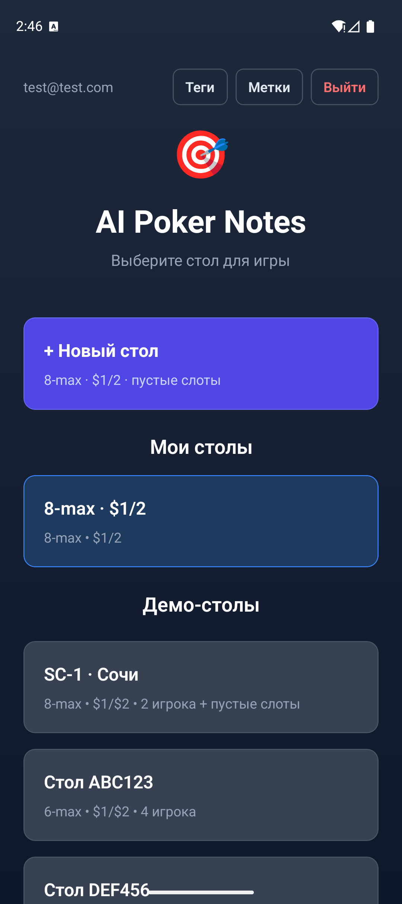
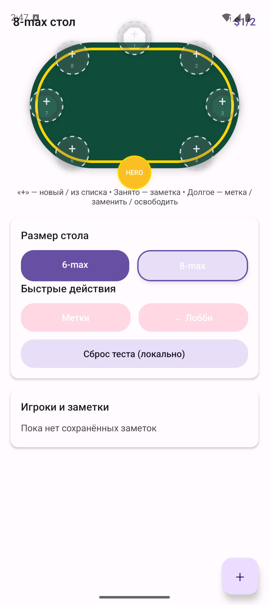
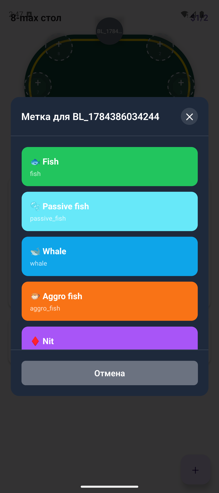
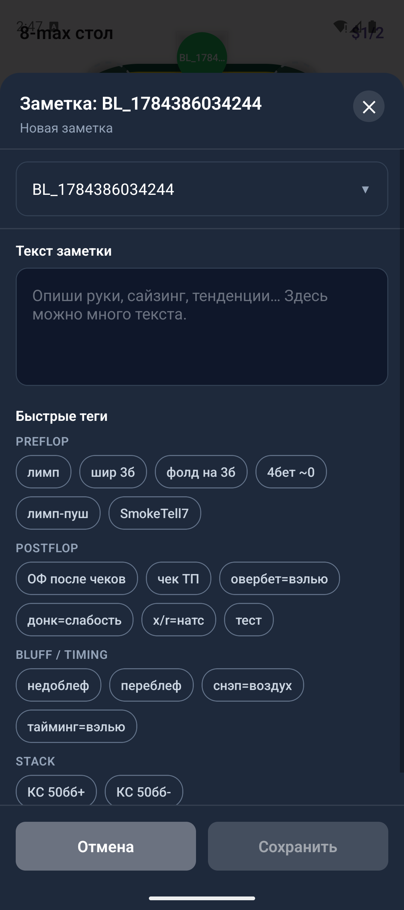
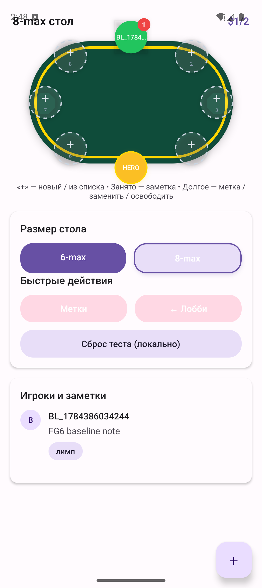

/**
 * @file: README.md
 * @description: Публичный README APN-MVP public alpha
 * @created: 2026-08-09
 */

# AI Poker Notes (APN-MVP)

**Status:** [`public alpha` / `v0.1.0-alpha`](https://github.com/mikhail-lashkin/apn-mvp-public/releases/tag/v0.1.0-alpha)  
**Репозиторий:** [mikhail-lashkin/apn-mvp-public](https://github.com/mikhail-lashkin/apn-mvp-public)  
**Стек:** Expo 54 / React Native · FastAPI · PostgreSQL · offline sync · hybrid recommendations

Мобильное приложение для live-покера: заметки по оппонентам за столом, цветовые метки (ColorSystem), офлайн-очередь синхронизации и опциональные hybrid-рекомендации (rule map + LLM).

**Продуктовый UI — только mobile** (`apps/mobile/`).

> Полевой прогон **2026-07-25** (реальный стол / казино): критического блокера не было; найденные требования ушли в backlog, а не в скрытый scope alpha. Подробнее: [`docs/demo/README.md`](docs/demo/README.md).

---

## Problem

За живым столом нужно быстро фиксировать наблюдения по игрокам и возвращаться к ним между раздачами — без тяжёлого desktop-workflow и без обязательного облака.

Ограничения live-игры: мало времени между раздачами, одна рука занята картами/фишками, сеть может пропасть, нельзя тащить laptop-UX.

---

## User scenario (2–3 минуты)

1. Lobby — выбрать или создать стол  
2. Рассадка — места, игрок (в т.ч. без имени)  
3. ColorSystem — метка типа оппонента  
4. QuickNote — текст и/или теги → Save  
5. Sync — очередь уходит на API при сети  

<p align="center">
  
  
  
</p>

<p align="center">
  
  
</p>

Скрины — emulator UI baseline (синтетические demo-данные). Полный набор и полевой отчёт: [`docs/demo/`](docs/demo/).

---

## Architecture

```text
Mobile (Expo / Zustand)
  ├─ UI: Lobby, Table, QuickNote, ColorSystem tags
  ├─ local persistence + offline queue
  └─ REST client ──► FastAPI (src/backend)
                         ├─ auth / notes / players / tables / sync
                         ├─ PostgreSQL
                         └─ ML: ColorSystem rule (+ optional LLM)
```

Ключевые trade-offs alpha:

| Решение | Почему |
|---------|--------|
| **Mobile-only** | Один продуктовый клиент; web shell не поддерживается |
| **Offline-first** | Заметки пишутся локально, sync — best effort |
| **Speed Focus UI** | Минимум тапов за столом (места, метки, quick note) |
| **Hybrid recommendation** | Rule baseline всегда доступен; LLM — опционально через env |

Подробнее: [`docs/architecture.md`](docs/architecture.md).

---

## Quick Start

Требования: Node 18+, Python 3.11+, Docker Desktop, Android emulator (опционально).

```bash
cp .env.example .env
python -m venv .venv
# Windows: .venv\Scripts\activate
pip install -r requirements.txt

npm run install:all
npm run docker:up
# API: http://localhost:8000/health  ·  docs: http://localhost:8000/docs

npm run dev              # Expo Metro
# или Windows: npm run dev:android
```

Setup: [`docs/setup.md`](docs/setup.md) · тесты: [`docs/testing.md`](docs/testing.md).

### Recommendations (optional)

По умолчанию `ML_LLM_PROVIDER=off` — только ColorSystem rule map.

```bat
set ML_LLM_PROVIDER=deepseek
set DEEPSEEK_API_KEY=...
```

См. [`docs/ml/recommendation.md`](docs/ml/recommendation.md).

---

## Structure

```text
apn-mvp-public/
├── apps/mobile/       # Expo / RN — единственный frontend
├── src/backend/       # FastAPI (бизнес-логика)
├── backend/           # Alembic + Dockerfiles
├── scripts/           # local Android / Maestro helpers
├── .maestro/          # E2E smoke flows
└── docs/              # architecture, setup, testing, ML, demo
```

---

## Status: Now vs Next

**Сейчас (public alpha):**

- live table notes + ColorSystem tags;
- auth + CRUD + offline sync к **local** API;
- hybrid recommendation с default `off`;
- полевая проверка 2026-07-25 без критического блокера.

**Дальше (roadmap, не обещание релиза):**

```text
стабилизация alpha → гибкий стол / 7-max → Live Hand Capture → ML/NLP extension
```

**Не обещаем как готовое:** production cloud, classical ML classifier с published F1, полный GTO-движок, Obsidian/TextExpander must-have.

---

## License

MIT — см. [`LICENSE`](LICENSE).
